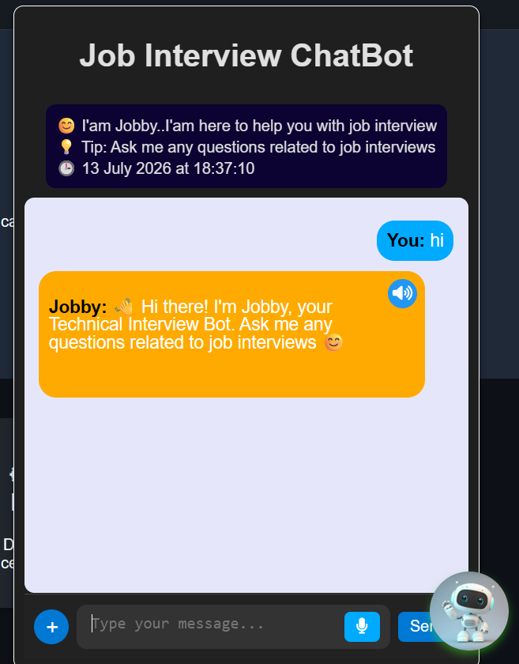
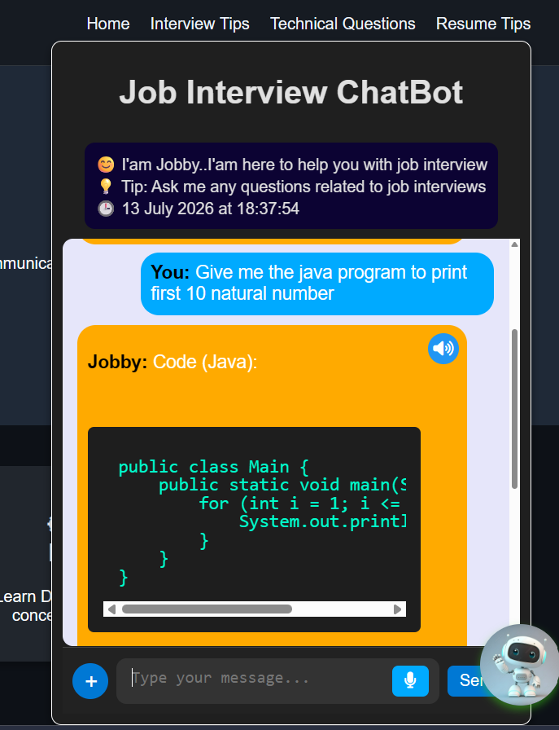
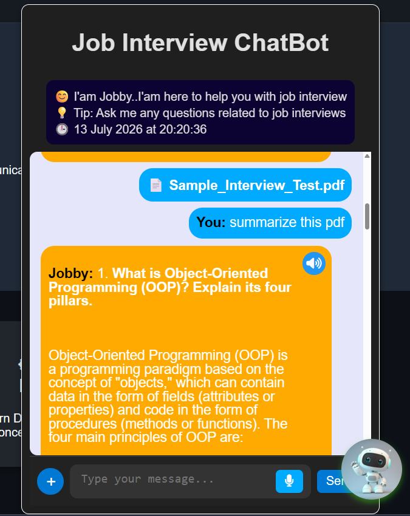
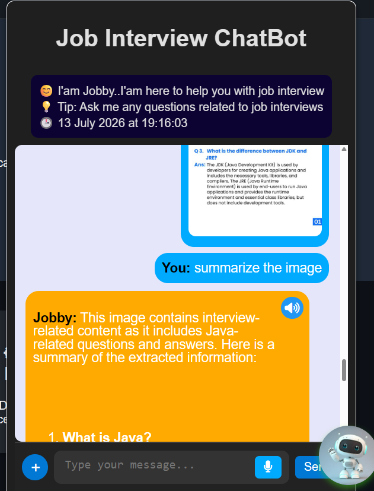
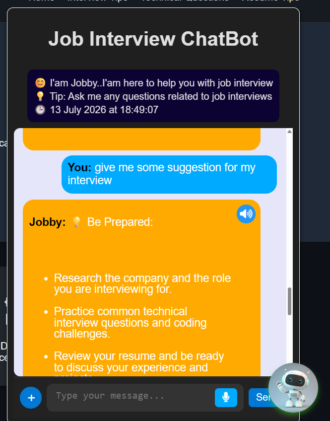
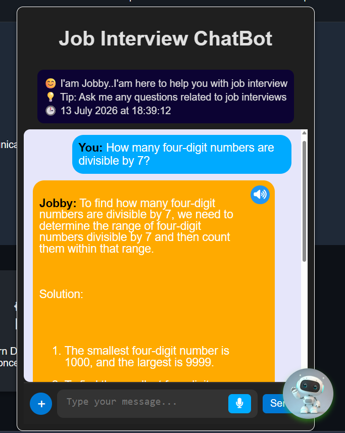

# 🤖 Jobby – AI Technical Interview Helper

An AI-powered Technical Interview Helper that assists users in preparing for technical interviews through voice interaction, PDF and image analysis, and intelligent question answering.

Built using **Flask** and **OpenRouter**.

---

## ✨ Features

- 💬 Technical interview question answering
- 🎤 Voice input (Speech-to-Text)
- 🔊 Voice output (Text-to-Speech)
- 📄 PDF upload and analysis
- 🖼️ Image upload with OCR (Tesseract OCR)
- 📚 PDF summarization
- 📝 Automatic interview question detection
- 💻 Programming solutions with explanations
- ⚡ Interactive chatbot interface

---

## 🛠️ Technologies Used

- Python
- Flask
- HTML
- CSS
- JavaScript
- OpenRouter API
- PyPDF
- Pillow
- Tesseract OCR
- Speech Recognition API
- Speech Synthesis API

---

## 📂 Project Structure

```
Jobby-AI-Interview-Chatbot/
│
├── app.py
├── openrouter_setup.py
├── requirements.txt
├── static/
├── templates/
├── README.md
└── .gitignore
```

---

## 🚀 How to Run

### 1. Clone the repository

```bash
git clone https://github.com/sudeeksha0412/Jobby-AI-Interview-Chatbot.git
```

### 2. Install dependencies

```bash
pip install -r requirements.txt
```

### 3. Create a `.env` file

```
OPENROUTER_API_KEY=your_api_key
```

### 4. Install Tesseract OCR

Download and install Tesseract OCR and update the executable path in `app.py`.

Example:

```python
pytesseract.pytesseract.tesseract_cmd = r"C:\Users\YourName\AppData\Local\Programs\Tesseract-OCR\tesseract.exe"
```

### 5. Run the application

```bash
python app.py
```

Open your browser and visit:

```
http://127.0.0.1:5000
```

---

## 🎯 Project Capabilities

- Answer technical interview questions
- Summarize interview PDFs
- Answer questions from uploaded PDFs
- Extract interview questions from images
- Explain programming questions with code
- Support voice-based interaction
- Interactive chatbot UI

---
---

## 📸 Screenshots

### 💬 Chatbot Interface

Interactive chatbot interface for asking interview-related questions.



---

### 💻 Technical Interview Question

Example of answering a technical interview question with explanation.



---

### 📄 PDF Upload & Analysis

Upload an interview PDF and ask questions or summarize its contents.



---

### 🖼️ Image OCR Analysis

Upload an image containing interview questions. The chatbot extracts the text using OCR and processes it.



---

### 📝 Multiple Question Answering

Jobby can answer multiple interview questions from an uploaded PDF or image in a single response, making interview preparation faster and more efficient.


---

### 🎤 Voice-Based Interaction

Jobby supports both **voice input** and **voice output** for a hands-free interview preparation experience.

- 🎙️ Click the **microphone** button to speak your question. Your speech is automatically converted into text and sent to the chatbot.
- 🔊 Click the **speaker** button below the chatbot's response to listen to the answer.
- 💻 If the response contains programming code, Jobby reads **only the explanation**, making it easier to understand without reading the code aloud.


### 🧠 Interview Suggestions

Provides interview preparation guidance and suggestions.



---

### 📊 Aptitude Question Solving

Supports aptitude and reasoning questions with step-by-step explanations.



---


## 👩‍💻 Author

**Sudeeksha **

B.E. Information Science & Engineering

Canara Engineering College

GitHub: https://github.com/sudeeksha0412
